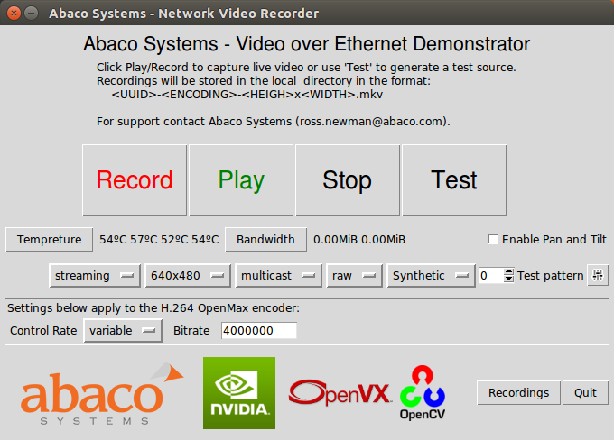
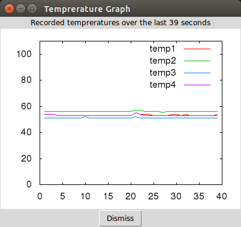
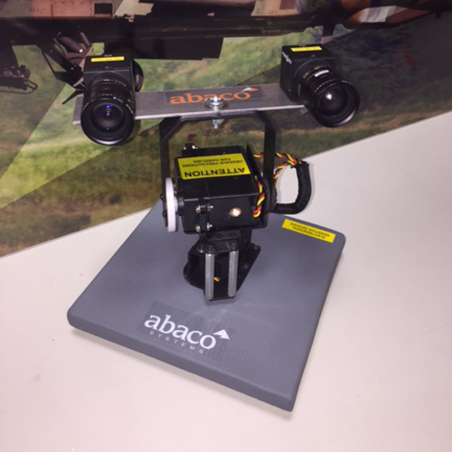

# abaco-launcher
Python application launcher for gstreamer RTP pipelines. Supports the Nvidia embedded Tegra products including the TK1 and TX1 SoM as well as Abaco Systems [MC10K1](https://www.abaco.com/products/mcom10-k1-mini-com-express) TK1 (Type 10) COM Express module.

# Project goals
- [x] Implement portable GUI gstreamer interface
- [x] Launcher for other Nvidia demos
- [x] Gstreamer streaming of RAW / H.264 / H.265 Ethernet streams
- [x] Enable Pololu servo controll of camer pan and tilt servos.
- [x] Gstreamer streaming of RAW / H.264 / H.265 Ethernet streams
- [x] TX1 & TK1 temperture sensing and logging
- [x] Transmit and receive Ethernet bandwidth logging

Some additional features that are planned.
- [ ] Parametrize launcher programs (read in demos from file).

# Installation
Clone the code:

    $ git clone https://github.com/ross-abaco/abaco-launcher
## Automated installation
For automated installation with the desktop shortcut run the makefile:

    $ cd ./abaco-launcher
    $ make install
For Uninstallation run:

    $ make uninstall
    $ make uninstall-apt # To remove any dependant apt-get packages
Once installed the launcher can be invoked from the desktop shortcut.

## Manual Installtion
For manual installation then install the dependancies:

    $ sudo apt-get install apt-get install python-imaging-tk gnuplot uuid-runtime
Run the Launcher without installing:

    $ cd ./opt/abaco/launcher
    $ ./recorder.py
   
## Screenshots

Launcher running on TK1

Temperture sensing on the TK1
## Pan and Tilt
Built in is support for a Polulu servo controller to drive a pan and tilt head like the one shown below. The joystick application uses SDL2 to connect an XBOX360 wireless joystick (USB dongle) enabling control of the camera mount. 

> note: Need to add more info about how to drive this.
# Links
* [Abaco Systems](http://abaco.com)
* [eLinux TX1](http://elinux.org/Jetson_TX1)
* [Nvidia devtalk](https://devtalk.nvidia.com/default/board/164/)
* [Abaco Systems MC10K1 - Tegra TK1 Mini COM Express module](https://www.abaco.com/products/mcom10-k1-mini-com-express)
* [Abaco Systems GRA113 - Maxwel GPGPU 3U VPX](https://www.abaco.com/products/gra113-graphics-board)

